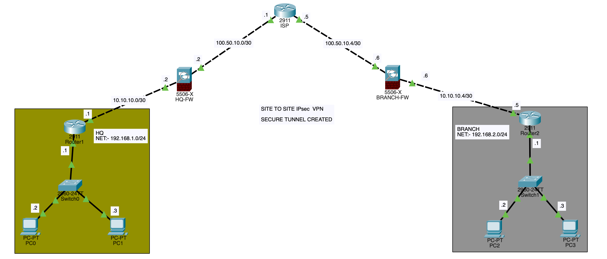

# Site-to-Site-ipsec-VPN-ospf-asa-packettracer
Site-to-Site IPsec VPN using Cisco ASA 5506-X with OSPF routing (Packet Tracer)

# Site-to-Site IPsec VPN (IKEv1) with OSPF – Cisco ASA 5506-X (Packet Tracer)

This lab demonstrates a secure **Site-to-Site IPsec VPN** between **HQ** and **Branch** using **Cisco ASA 5506-X** firewalls. **OSPF Area 0** is used for dynamic routing between routers and firewalls. The solution is built and tested in **Cisco Packet Tracer**.

## Features
- OSPF (Process 10, Area 0) across routers + ASA
- ASA interface zoning (INSIDE: 100, OUTSIDE: 0)
- Dynamic PAT (NAT to outside interface)
- Basic inbound ACL on OUTSIDE (ICMP, HTTP, HTTPS)
- Site-to-Site IPsec VPN (IKEv1, 3DES/SHA, PSK)

---

## Topology

**WAN**
- HQ-FW ↔ ISP: `100.50.10.0/30`
- ISP ↔ Branch-FW: `100.50.10.4/30`

**Inside / Transit**
- HQ-R1 ↔ HQ-FW: `10.10.10.0/30`
- Branch-R2 ↔ Branch-FW: `10.10.10.4/30`

**LANs**
- HQ LAN: `192.168.1.0/24`
- Branch LAN: `192.168.2.0/24`

---

## Device Inventory
- (1) Cisco 2911 ISP Router
- (2) Cisco 2911 Routers (HQ Router1, Branch Router2)
- (2) Cisco ASA 5506-X Firewalls (HQ-FW, BRANCH-FW)
- (2) Cisco 2960 Switches
- (4) PCs (2 at HQ, 2 at Branch)

---

## Config Files
All configs are stored under:
- `configs/routers/`
- `configs/firewalls/`

---

## How to Run (Packet Tracer)
1. Open `packet-tracer/project.pkt`
2. Wait for devices to boot.
3. Generate interesting traffic (ping HQ LAN ↔ Branch LAN) to bring up the VPN.

---

## Verification
Suggested commands (ASA):
- `show ospf neighbor`
- `show route`
- `show crypto ikev1 sa`
- `show crypto ipsec sa`

See `docs/verification.md` for the checklist.

---

## Notes / Improvements
In real deployments, you typically configure **NAT exemption** for VPN traffic. Packet Tracer ASA behavior may differ, but the lab demonstrates the standard configuration workflow.

---

## Author
Ankit Kuttarmare
